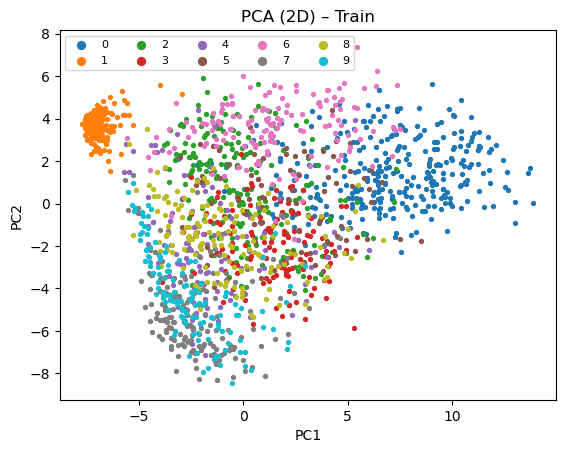
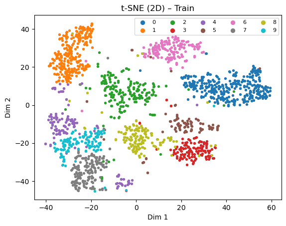
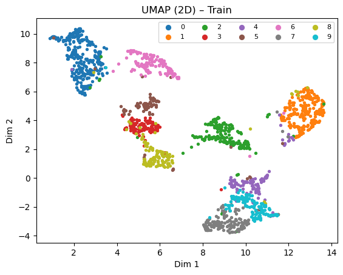
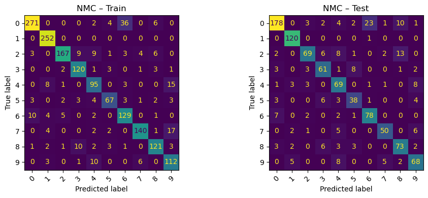
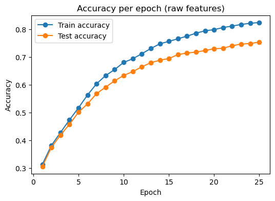
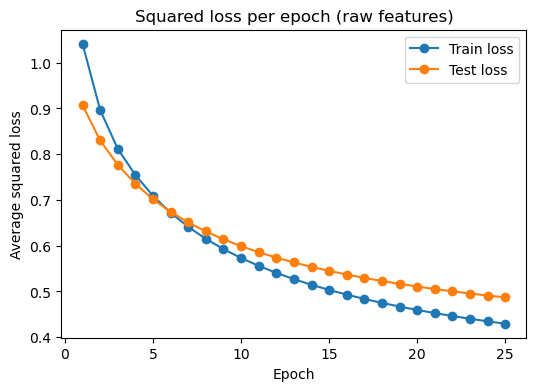
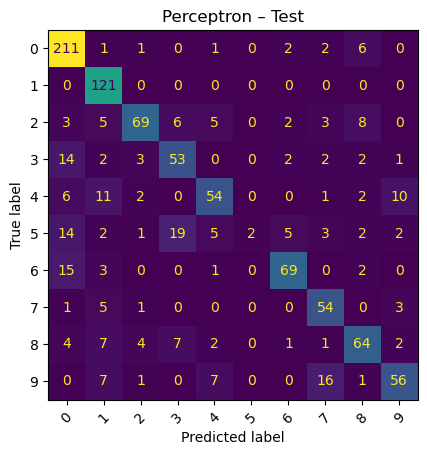
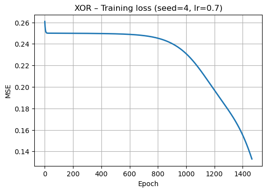

# Distance-Based Classifiers, a Multi-Class Perceptron, and an XOR Network from Scratch

Three classical classifiers built on a 256-feature handwritten-digit dataset, plus a
two-layer network trained with hand-derived backpropagation on XOR. Everything runs on
raw pixel features so the distance-based and linear models are compared on identical
input. NumPy only for the models we wrote ourselves; scikit-learn is used for KNN, PCA
and t-SNE.

**Distance-weighted KNN wins at 91.6% test accuracy, but the two more interesting
results are about how fragile the other numbers are.** The XOR network is usually
described as "always converging" — and it did in all five configured trials — yet the
same network with the same seed and learning rate fails with 2 of 4 points misclassified
when the epoch budget is 5000 instead of 10000. It spends thousands of epochs stuck on a
plateau at MSE ≈ 0.25 with every output pinned near 0.5, and only escapes afterwards.
Separately, the perceptron's headline 75.3% is not a property of the model: it was
trained with 25 full-batch gradient steps at a learning rate the sweep later showed was
too small. At lr = 0.01 the same perceptron reaches 82.0%, cutting its gap to KNN from
16 points to 10.

**Full write-up:** [`report.pdf`](report.pdf)

## Background

The dataset is grayscale handwritten digits, each flattened to a 256-dimensional vector
with values in [-1, 1], labelled 0–9. There are 1,707 training and 1,000 test samples.
The classes are unbalanced — digit 0 has 319 training samples, digit 5 has 88.

The task is non-trivial for a linear model because several digit classes sit close
together in pixel space and are not linearly separable from one another. The three
approaches probe different structure:

- **Nearest Mean Classifier (NMC)** reduces each class to one prototype vector. It can
  only work if class means are far apart.
- **K-Nearest Neighbors** uses local neighbourhoods instead of a global prototype, so it
  can follow non-linear class boundaries.
- **Multi-class perceptron** learns one linear scoring function per class, trained here
  by full-batch gradient descent on squared loss with light L2 (1e-5) and gradient-norm
  clipping at 5.0.

XOR is the separate, minimal case: four points that no single linear boundary can
separate, used to show that one hidden layer is enough.

## Results

### Which digits are confusable

Class centres were computed as per-class mean vectors and compared by Euclidean
distance. The closest pairs are (7,9) at 5.43, (4,9) at 6.01, (3,5) at 6.12, (8,9) at
6.40 and (5,6) at 6.70 — the same pairs humans confuse in handwriting.


This prediction holds up: the residual errors of every model below concentrate on 4↔9,
3↔5 and 7↔9. Inter-class distance measured before any training tells you where the
classifiers will fail.

### Dimensionality reduction

| Method | What it shows |
|---|---|
| PCA (2D) | 28.5% of total variance in two components. Clusters are visible but overlap heavily, especially 4/9 and 3/5. |
| t-SNE (2D) | Tighter clusters, better separation than PCA, still some class overlap. |
| UMAP (2D) | The most compact and clearly separated clusters of the three. |





That PCA explains only 28.5% of variance in two dimensions is the useful number here: it
says the data genuinely occupies many dimensions, and that the visible overlap in the PCA
plot is a projection artifact rather than proof the classes are inseparable. The
non-linear projections, which are not constrained to a linear subspace, separate them
much better — an early hint that KNN will beat the perceptron.

### Classifier accuracy

| Model | Train acc | Test acc |
|---|---|---|
| NMC | 0.8635 | 0.8040 |
| KNN (k=3, distance-weighted) | 1.0000 | **0.9160** |
| Perceptron (lr=0.005, 25 steps, seed 42) | 0.8237 | 0.7530 |
| Perceptron (lr=0.01, mean of 5 seeds) | — | 0.8204 |

KNN sweep over k, distance-weighted with Euclidean metric:

| k | Train acc | Test acc |
|---|---|---|
| 1 | 1.0000 | 0.9150 |
| 3 | 1.0000 | **0.9160** |
| 5 | 1.0000 | 0.9160 |
| 7 | 1.0000 | 0.9100 |

Train accuracy is 1.0000 at every k because distance weighting gives a training point
infinite weight on itself — that number carries no information. The test column is flat
across k = 1, 3, 5 and only drops at k = 7, which says the digit neighbourhoods are
locally pure: widening the neighbourhood starts pulling in the wrong class before it
starts helping.




NMC at 80.4% is a genuinely strong showing for a model that stores ten vectors and does
no training at all. Its 11-point gap to KNN is the cost of collapsing each class to a
single prototype.

### Perceptron training

Trained for 25 full-batch gradient steps. Train loss falls 1.041 → 0.430 and test loss
0.907 → 0.487, both still declining at the last step.





Learning rate sweep, four rates × five seeds, 25 steps each:

| Learning rate | Mean test acc | Std |
|---|---|---|
| 0.001 | 0.4620 | 0.0168 |
| 0.002 | 0.6094 | 0.0095 |
| 0.005 | 0.7652 | 0.0047 |
| 0.01 | **0.8204** | 0.0085 |


Accuracy moves 36 points across this range while the standard deviation across seeds
never exceeds 0.017. Within a fixed step budget, the step size matters far more than
initialisation.

### XOR network

A 2–2–1 network with sigmoid activations, MSE loss and gradients derived by hand.
Training stops at the first epoch with 0 of 4 points misclassified.

| Seed | lr | Max epochs | Epochs to 0/4 | Final MSE |
|---|---|---|---|---|
| 0 | 0.5 | 10000 | 6483 | 0.1380 |
| 1 | 0.5 | 10000 | 4185 | 0.1217 |
| 2 | 0.5 | 10000 | 3032 | 0.1247 |
| 3 | 0.3 | 10000 | 4952 | 0.1307 |
| 4 | 0.7 | 10000 | 1466 | 0.1326 |
| 0 | 0.5 | 5000 | **never reached — 2/4 wrong** | 0.2490 |




The last row is the same configuration as the first, cut off 1,483 epochs early. At that
point the network output every one of the four inputs between 0.483 and 0.514 — it had
not yet committed to any decision boundary.

## Discussion

**Why KNN wins.** The digit classes form tight local clusters that are not linearly
separable from one another. KNN reads local structure directly and needs no global
decision surface, so class overlap costs it only the points at the boundary. The
perceptron has to draw one hyperplane per class through the whole 257-dimensional space
and cannot bend it, so every non-linear boundary costs it systematically. NMC is the
weakest but most interpretable: its errors are a direct readout of the inter-class
distance matrix from the first step.

**Why the perceptron's number is a floor, not a ceiling.** Both loss curves were still
falling steeply at step 25, and raising the learning rate to 0.01 within the same budget
adds seven points. Part of the reported gap to KNN is undertraining rather than linear
inseparability. The linear limit is real, but 75.3% does not measure it.

**Why the XOR loss curve has a long flat start.** For thousands of epochs the loss sits
at roughly 0.25 — exactly the MSE of predicting 0.5 for all four points, which is what a
network with small initial weights does, since the sigmoid is near-linear around zero and
the whole network collapses to something close to a linear map. Escaping requires the
hidden weights to grow enough to push the units into their saturating regions, and that
happens slowly under gradient descent. The plateau length varies from 1,466 to 6,483
epochs depending only on seed and learning rate. Any fixed epoch budget in that range
turns "always converges" into "sometimes converges".

**The convergences are also narrower than they look.** Final MSE never falls below 0.12,
and the deciding output probabilities are 0.5008, 0.4989, 0.4987, 0.5011 and 0.4989 —
margins of about 0.001 either side of the 0.5 threshold. The network is stopped the
moment it crosses, not once it has settled. "0 of 4 misclassified" is true and, on its
own, misleading.

## Limitations

- **k and the learning rate were both selected on test accuracy.** There is no validation
  split, so 0.9160 for KNN and the sweep means for the perceptron are optimistic
  estimates of held-out performance.
- **The perceptron's headline run uses one seed (42) and a fixed 25-step budget**, chosen
  before the sweep. Only the sweep is averaged across seeds; the confusion matrix and the
  training curves are not.
- **XOR training stops at the first zero-error epoch,** so the final MSE reflects the
  stopping rule rather than convergence, and the reported margins are knife-edge.
- **The dataset is course-provided and is not redistributed here,** so the notebook cannot
  be run end to end from this repository alone.
- **Test-set class balance is uneven** — 224 samples for digit 0 against 55 for digit 5 —
  so overall accuracy is weighted toward the common digits, and no per-class or macro
  score is reported.

## Repository structure

| Path | Purpose |
|---|---|
| `notebook.ipynb` | All three tasks, with outputs and plots preserved |
| `report.pdf` | Full write-up, methods and analysis |
| `figures/` | Plots extracted from the notebook, embedded above |
| `requirements.txt` | Dependencies |

## Data

Not included in this repository. The notebook expects four headerless CSV files in its
working directory:

| File | Shape | Contents |
|---|---|---|
| `train_in.csv` | 1707 × 256 | float features in [-1, 1] |
| `train_out.csv` | 1707 × 1 | integer labels 0–9 |
| `test_in.csv` | 1000 × 256 | float features in [-1, 1] |
| `test_out.csv` | 1000 × 1 | integer labels 0–9 |

Training class counts, digits 0 through 9: 319, 252, 202, 131, 122, 88, 151, 166, 144,
132. Test class counts: 224, 121, 101, 79, 86, 55, 90, 64, 92, 88. No missing values.

## Requirements

```
numpy
pandas
matplotlib
scikit-learn
umap-learn
```

Developed on Python 3.12. `umap-learn` is imported unconditionally in the dimensionality
reduction section, so the notebook will fail there if it is not installed rather than
skipping the UMAP plot.

## Running it

```bash
pip install -r requirements.txt
jupyter notebook notebook.ipynb
```

Place the four CSV files in the same directory as the notebook, then run all cells in
order. The t-SNE and UMAP fits are the slowest steps; everything else is seconds.

## Contributions

- Nallathambi Vethiappan
- Deepak Somesh K J
- Divyanshi Singh
