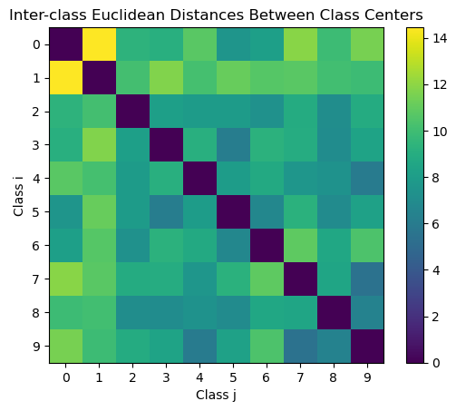
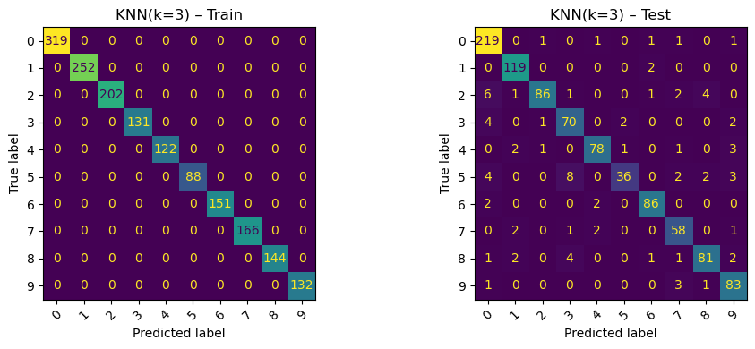
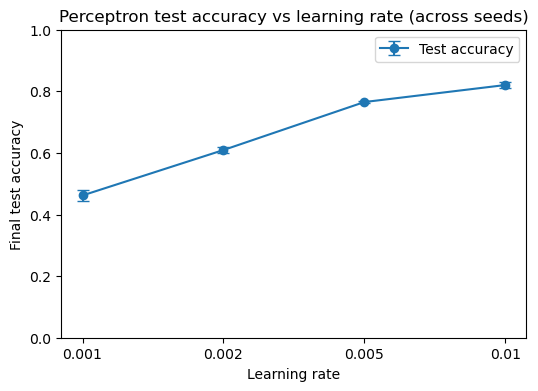
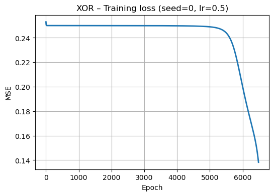

# Distance-Based Classifiers, a Multi-Class Perceptron, and an XOR Network from Scratch

Three classical classifiers on a 256-feature handwritten-digit dataset, plus a two-layer network
trained with hand-derived backpropagation on XOR. Everything runs on raw pixel features so the
distance-based and linear models are compared on identical input.

**Distance-weighted KNN wins at 91.6% test accuracy, but the two more interesting results are about
how fragile the other numbers are.** The XOR network converged in all five configured trials, yet the
same network with the same seed and learning rate fails with 2 of 4 points misclassified when the
epoch budget is 5000 instead of 10000 — it sits for thousands of epochs on a plateau at MSE ≈ 0.25
with every output near 0.5. Separately, the perceptron's 75.3% is not a property of the model: it was
trained with 25 full-batch steps at a learning rate the sweep later showed was too small. At lr = 0.01
the same perceptron reaches 82.0%.

**Full write-up:** [`report.pdf`](report.pdf)

## Background

The dataset is grayscale handwritten digits flattened to 256-dimensional vectors with values in
[-1, 1], labelled 0–9: 1,707 training and 1,000 test samples, unbalanced across classes. Several digit
classes sit close together in pixel space and are not linearly separable from one another, which is
what makes the comparison interesting.

NMC reduces each class to one prototype vector; KNN uses local neighbourhoods instead, so it can
follow non-linear boundaries; the multi-class perceptron learns one linear scoring function per class,
trained by full-batch gradient descent on squared loss with light L2 (1e-5) and gradient-norm clipping
at 5.0. XOR is the separate minimal case: four points no single linear boundary can separate.

## Results

### Which digits are confusable

Class centres were computed as per-class mean vectors and compared by Euclidean distance. The closest
pairs are (7,9) at 5.43, (4,9) at 6.01, (3,5) at 6.12, (8,9) at 6.40 and (5,6) at 6.70 — the pairs
humans confuse in handwriting.



The residual errors of every model below concentrate on those same pairs — inter-class distance
measured before any training tells you where the classifiers will fail. PCA captures only 28.5% of variance in two
components, so the overlap a 2D projection shows is partly an artifact of the projection.

### Classifier accuracy

| Model | Train acc | Test acc |
|---|---|---|
| NMC | 0.8635 | 0.8040 |
| KNN (k=3, distance-weighted) | 1.0000 | **0.9160** |
| Perceptron (lr=0.005, 25 steps, seed 42) | 0.8237 | 0.7530 |
| Perceptron (lr=0.01, mean of 5 seeds) | — | 0.8204 |

KNN sweep over k, distance-weighted with Euclidean metric:

| k | 1 | 3 | 5 | 7 |
|---|---|---|---|---|
| Test acc | 0.9150 | **0.9160** | 0.9160 | 0.9100 |

Train accuracy is 1.0000 at every k, since distance weighting gives a training point infinite weight
on itself. Test accuracy is flat across k = 1, 3, 5 and only drops at k = 7: the neighbourhoods are
locally pure, so widening them pulls in the wrong class before it starts helping.



NMC at 80.4% is a strong showing for a model that stores ten vectors and does no training at all; its
11-point gap to KNN is the cost of collapsing each class to a single prototype.

### Perceptron training

Trained for 25 full-batch gradient steps, with train loss falling 1.041 → 0.430 and test loss
0.907 → 0.487, both still declining at the last step. Learning rate sweep, four rates × five seeds:

| Learning rate | 0.001 | 0.002 | 0.005 | 0.01 |
|---|---|---|---|---|
| Mean test acc | 0.4620 | 0.6094 | 0.7652 | **0.8204** |
| Std | 0.0168 | 0.0095 | 0.0047 | 0.0085 |



Accuracy moves 36 points across this range while the standard deviation across seeds never exceeds
0.017. Within a fixed step budget, step size matters far more than initialisation.

### XOR network

A 2–2–1 network with sigmoid activations, MSE loss and gradients derived by hand. Training stops at
the first epoch with 0 of 4 points misclassified.

| Seed | lr | Max epochs | Epochs to 0/4 | Final MSE |
|---|---|---|---|---|
| 0 | 0.5 | 10000 | 6483 | 0.1380 |
| 1 | 0.5 | 10000 | 4185 | 0.1217 |
| 2 | 0.5 | 10000 | 3032 | 0.1247 |
| 3 | 0.3 | 10000 | 4952 | 0.1307 |
| 4 | 0.7 | 10000 | 1466 | 0.1326 |
| 0 | 0.5 | 5000 | **never reached — 2/4 wrong** | 0.2490 |



The last row is the same configuration as the first, cut off 1,483 epochs early. At that point the
network output every one of the four inputs between 0.483 and 0.514 — it had not committed to any
decision boundary.

## Discussion

**Why KNN wins, and why the perceptron's number is a floor.** KNN reads local structure directly and
needs no global decision surface, so overlap between classes costs it only boundary points. The
perceptron must draw one hyperplane per class through the whole 257-dimensional space and cannot bend
it. That limit is real, but 75.3% does not measure it: both loss curves were still falling steeply at
step 25, and raising the learning rate within the same budget adds seven points.

**Why the XOR loss curve has a long flat start.** For thousands of epochs the loss sits at roughly
0.25 — exactly the MSE of predicting 0.5 for all four points, which is what small initial weights
produce, since the sigmoid is near-linear around zero. Escaping requires the hidden weights to grow
into their saturating regions, which is slow under gradient descent. The plateau lasts between 1,466
and 6,483 epochs depending only on seed and learning rate, so any fixed budget in that range turns
"always converges" into "sometimes converges". The convergences are narrow too: final MSE never falls
below 0.12, and the deciding probabilities sit about 0.001 either side of the 0.5 threshold.

## Limitations

- **k and the learning rate were both selected on test accuracy.** There is no validation split, so
  0.9160 and the sweep means are optimistic estimates of held-out performance.
- **The perceptron's headline run uses one seed (42) and a fixed 25-step budget** chosen before the
  sweep. Only the sweep is averaged across seeds.
- **XOR training stops at the first zero-error epoch,** so the final MSE reflects the stopping rule
  rather than convergence.
- **Test-set class balance is uneven** — 224 samples for digit 0 against 55 for digit 5 — so overall
  accuracy is weighted toward the common digits, and no macro score is reported.
- **The dataset is course-provided and is not redistributed here.**

## Repository structure

| Path | Purpose |
|---|---|
| `notebook.ipynb` | All three tasks, with outputs and plots preserved |
| `report.pdf` | Full write-up, methods and analysis |
| `figures/` | Plots extracted from the notebook, embedded above |

## Data

Not included in this repository. The notebook expects four headerless CSV files in its working
directory:

| File | Shape | Contents |
|---|---|---|
| `train_in.csv` | 1707 × 256 | float features in [-1, 1] |
| `train_out.csv` | 1707 × 1 | integer labels 0–9 |
| `test_in.csv` | 1000 × 256 | float features in [-1, 1] |
| `test_out.csv` | 1000 × 1 | integer labels 0–9 |

## Requirements and running it

```
numpy
pandas
matplotlib
scikit-learn
umap-learn
```

```bash
pip install -r requirements.txt
jupyter notebook notebook.ipynb
```

Developed on Python 3.12. Place the four CSV files in the same directory as the notebook, then run all
cells in order. `umap-learn` is imported unconditionally, so the notebook fails at the dimensionality
reduction step if it is missing rather than skipping the plot.

## Contributions

- Nallathambi Vethiappan
- Deepak Somesh K J
- Divyanshi Singh
